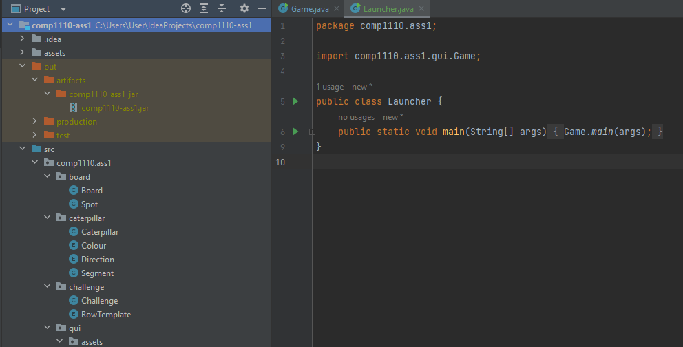

+++
title = "Turning JavaFX Into an Executable in 2023"
date = "2023-05-14"
+++

In my university course this semester, I was tasked with creating a JavaFX game. As this was my first big project, this was a difficult but rewarding challenge where I learned so much. While I go into more detail about the project [here](https://jackwrfuller.github.io/projects/blue-lagoon), I wanted to share some of the smaller things I learned while embarking on this journey so that one day someone out there will not have to spend the same ridiculous hours troubleshooting and furiously googling that I did.  

As it turned out, one of the most surprising tasks in terms of its difficulty was turning the JavaFX game first into a jar file, and then an executable. Early on in the project, I thought it would be cool to turn the game into a standalone application - you know, like a proper game. Since I am developing on a Windows machine, this was a .exe file. I thought to myself that it would be a matter of pressing some button in IntelliJ (my IDE). Oh boy, how wrong I was. So, in the hope to save some poor soul the tribulations I did, I want to share how to turn a JavaFX project in IntelliJ into an exe file. 

# My set up
For the sake of reproducibility, here is my set up:
- Windows 10
- Java 17 (OpenJDK 17.0.6)
- JavaFX 17.0.6
- IntelliJ IDEA 2022.3.2 (Ultimate Edition)

There are many great tutorials for the installation of the above, so I wont go into it here. Furthermore, you will need [Launch4J](https://launch4j.sourceforge.net/), which is my solution for converting jar files to windows executables.

# From Java to Jar
You might think that building a jar file, especially in a modern IDE such as IntelliJ, would be trivial. Perhaps in a normal case without JavaFX, this would be the case. However, for whatever reason, JavaFX definitely throws a spanner in the works. 

**1. Create a Launcher class:** For some reason that isnt clear to me, the method developed in this how-to only works if we launch our jar from a separate 'launcher' class rather than directly from the main JavaFX class. First, we have to add the following main method to the main game class:

```java
 public static void main(String[] args) {
        launch(args);
    }
```
When this `main()` method is called, it starts the application. Next, create a new class *in the same directory* called `Launcher`, and give it only one method:
```java
public class Launcher {
    public static void main(String[] args) {
        Game.main(args);
    }
}
```
Where `Game` is of course the main game class. To test the set up is working so far, run `Launcher.main()`; if all is well, the game should run as normal.

**2. Create and build the artifact:**
Now we must create a Java artifact which once built will give us our jar file. First, navigate to `File` -> `Project Structure`. This will take you to a pop-up menu, where you must click on `Artifacts` under `Project Settings`.
<p align="center" width="100%">
    
</p>

Then click the "+" -> "JAR" -> "From modules with dependencies": 

<p align="center" width="100%">
    
</p>

This will prompt you to select the `Main Class`. In our case, we will use the `Launcher` class we made earlier.

<p align="center" width="100%">
    
</p>

Next, the devious step: if you leave it as is, the jar file made will not run and throw a whole bunch of errors. It turns out we must manually add in the whole `bin` directory of our JavaFX installation. On my machine this is located in a ".jdks" file, but for you it could be elsewhere. To do this click on the "+" -> "Directory Content": 

<p align="center" width="100%">
    
</p>

then navigate to your JavaFX bin folder and select that.

<p align="center" width="100%">
    
</p>

Click `Apply` then `Ok`. We are now ready to build our artifact. To do this, on the top menu select `Build` -> `Build Artifacts...` which brings up the following menu:

<p align="center" width="100%">
    
</p>

Select `Build`, wait a bit, and then you will have a ready-to-go jar file saved in your `out` directory inside the root directory:

<p align="center" width="100%">
    
</p>

If you have done everything right so far, you should be able to right click on this jar file and run it. 

# From Jar to Exe

Now that we have a working Jar file, we are very close the our desired executable. Of course, now that you are at this stage, you can take this jar and do many other things with it. For example, if you have a Mac machine, you can convert it to a MacOS application. In our case, we will use the tool [Launch4J](https://launch4j.sourceforge.net/) to build our exe. There may be other ways to do this, but I am not aware of them as of the writing of this article. In any case, Launch4J is fairly straightforward.

<p align="center" width="100%">
    
</p>

There are only two fields you have to concern yourself with: "Output file" and "Jar". For the "Jar", select the jar file we just built above. For the "Output file" field, select the directory you want to output the executable into, and give a name: "\<insert-name\>.exe". Then, click the cog icon on the top menu. This will force to create an XML save file, which you can give "\<any-name\>.xml" and save anywhere. If all has gone to plan, the log down the bottom should say "Successfully created \<location\>\\game.exe". To confirm everything is working, click the blue play button on the menu, which will automatically launch the executable.

Voila! You have just created a JavaFX windows executable.

